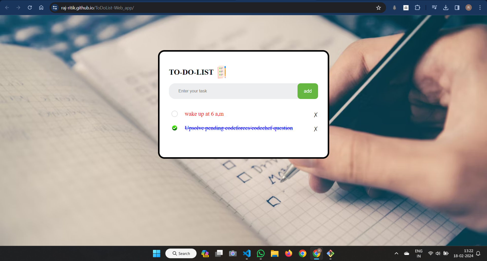

# 📖 ToDoList-Web_app

A tool that helps to organize your day. It simply lists the things that you need to do and allows you to mark them as complete.

### Key Features 

- **Adding a new item**
- **Removing a selected item**
- **Marking a selected item as complete**
- **Changing of text color once it is marked**
- **Saving the tast on local storage so that the tasks are dispalyed when website is revisited/reloaded**

# Demo
